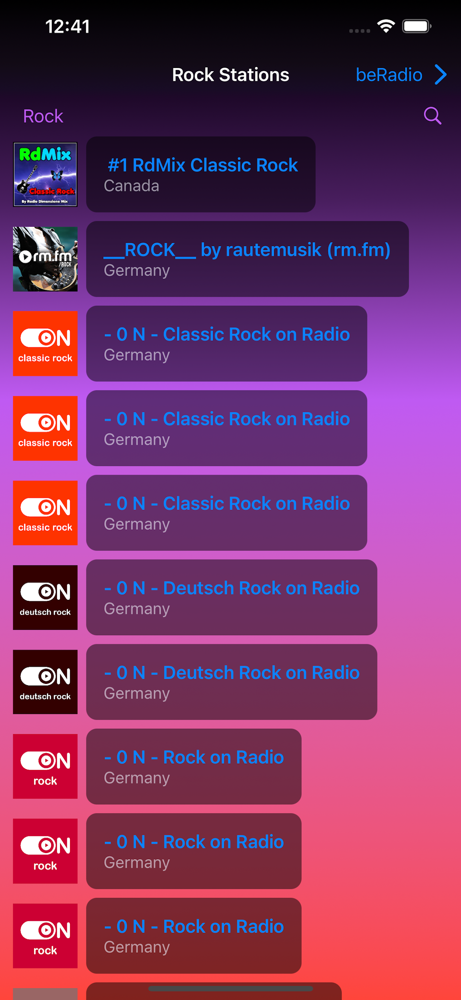

<!DOCTYPE html>
<html>
<head>
  <h3>beRadio</h3>
</head>
<body>
    <div align="center">
        
        <h1>Welcome to beRadio</h1>
    </div>
<!--     <p>
        beRadio is an application that lets you listen to a variety of radio stations, 
        featuring a comprehensive buffering system for seamless listening experience. 
        Search through a multitude of genres and locations to find your favorite station!
    </p> -->
  beRadio is a free application that lets you listen to a multitude of radio stations, featuring a robust buffering system for a seamless listening experience. You can easily search through various genres and locations to find your favorite station!

  ## Screenshots

<div align="center">
    
    
    
</div>
  
## Installation

To install beRadio on your iPhone or iPad, follow these steps:

1. First, you'll need to have [Xcode](https://developer.apple.com/xcode/) installed on your macOS system. You can download it for free from the Mac App Store.

2. Clone this repository to your local machine using Git. You can do this by opening Terminal and running the following command:
```bash
git clone https://github.com/waverun/beRadio.git
 ``` 
 
3. Open the cloned repository folder, and there you'll find a file with the extension .xcodeproj. Double click on this file to open the project in Xcode.
  
4. With the project open in Xcode, connect your iPhone or iPad to your Mac using a USB cable.
  
5. In Xcode, select your device from the list of available devices in the top bar.
  
6. Press the "Play" button (or press Cmd+R) in the top left corner of Xcode to build and run the app. Xcode will install the app onto your device.
You may need to trust the developer on your iPhone or iPad. To do this, go to Settings -> General -> Device Management, tap your email under Developer App, and tap Trust.

7. Once the app is installed, you'll find it on your device's home screen, ready for use!
  
Please note: You must have a valid Apple ID to install apps onto an iPhone or iPad using Xcode. This is a requirement of Apple's iOS development process.

</body>
</html>
